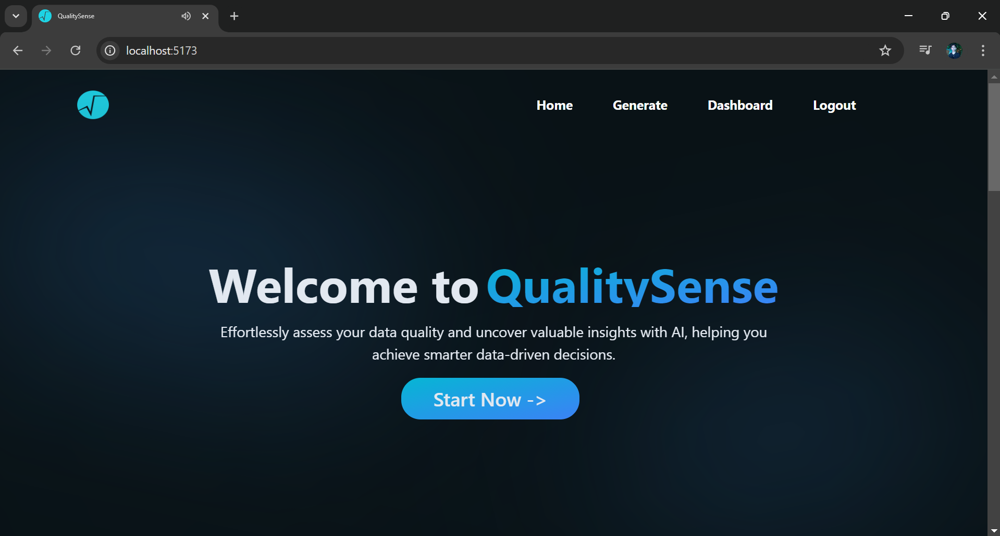
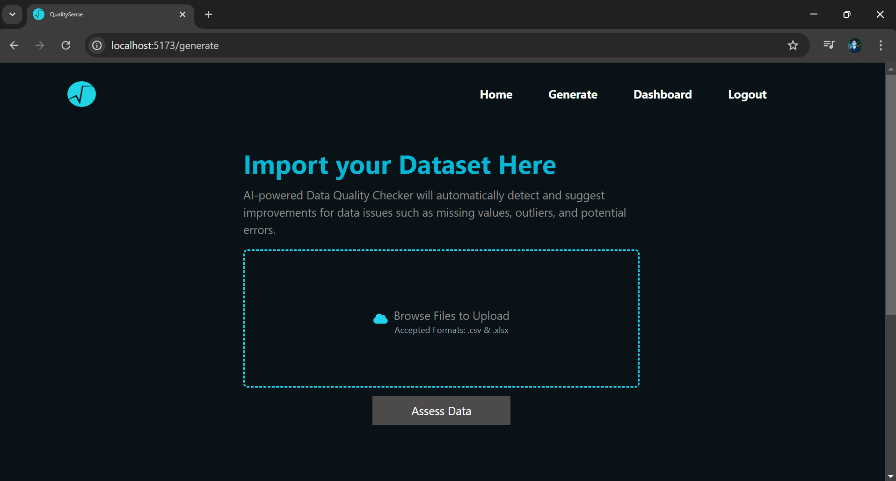
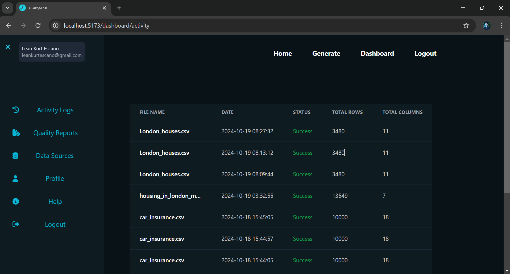
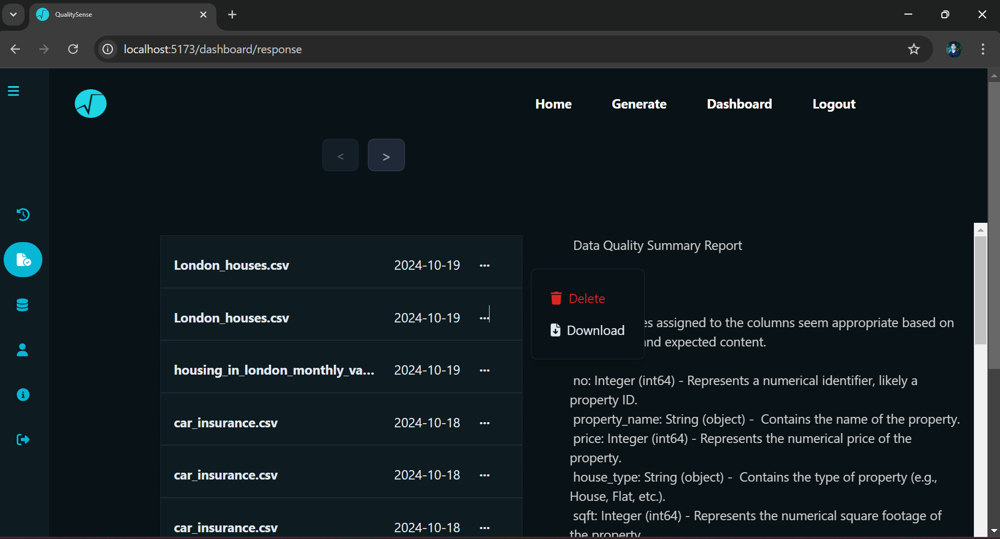
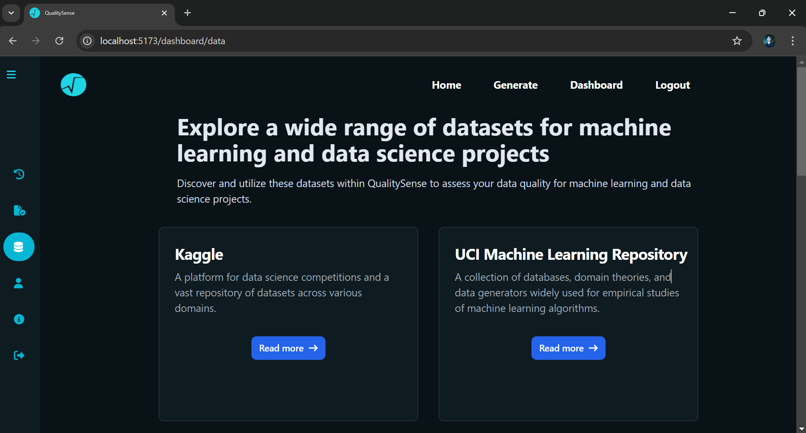
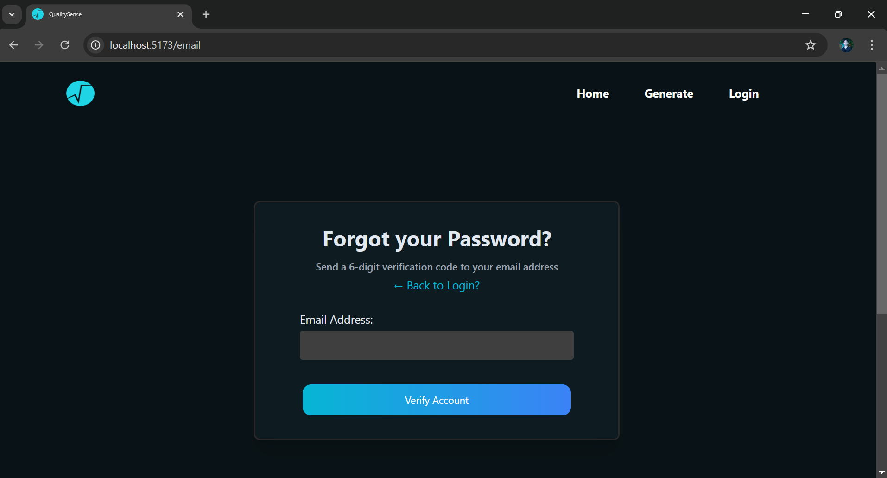
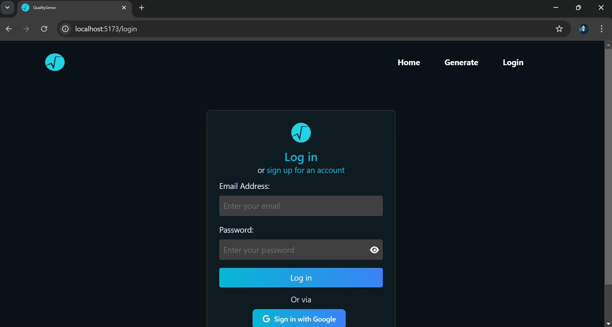
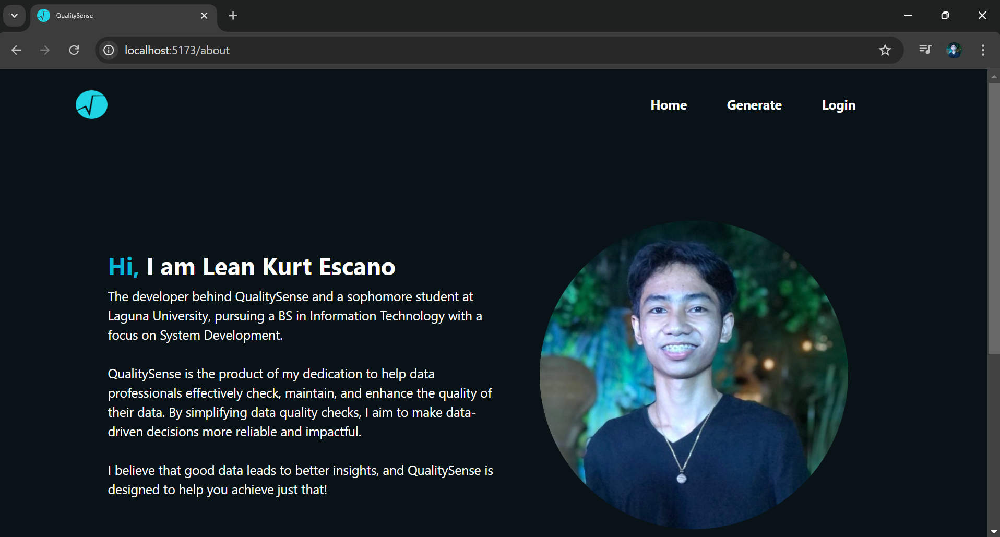

# QualitySense

QualitySense is a data quality checker assistant designed to help users identify missing values, outliers, categorical errors, and potential misspellings in their datasets. Powered by AI, the app not only detects these issues but also generates a Data Quality Summary Report that includes actionable suggestions. This dual capability provides valuable insights, enabling users to make informed decisions more effectively while enhancing overall data quality.

## Tech Stack

### Frontend
* React.js
* TypeScript
* Tailwind CSS

### Backend
* Django
* Django REST Framework
* PostgreSQL

### Additional Technologies
* Google Gemini
* Pandas
* OAuth 2.0
* JWT

## Key Features

* Offers secure login options, including traditional username & password (Custom Signup) with a 6-digit Email OTP and Google Login (OAuth 2.0) for convenience and security.

* Identifies missing values, outliers, categorical errors, and potential misspellings in datasets.

* Provides recommendations/suggestions for fixing the identified data issues.

* Generates a detailed report summarizing data quality findings and suggested actions for improvement. Users can also download the report in .pdf format for easy sharing and reference.

* A personalized dashboard where users can view the history and status of their activities, providing a clear overview of their engagement with the application.

* A page that displays the history of Data Quality Summary Reports generated by AI. Users can also download those reports in .pdf format or delete them as needed, ensuring they have access to relevant insights and can manage their reports effectively.

## API Throttling

To ensure optimal performance and reliability, the Generate page implements an API throttling mechanism. Users are allowed to make **up to 2 requests per minute**. This limit is set to comply with the capabilities of the Gemini AI service, which can handle a maximum of **15 requests per minute** overall. 

### Throttling Details:

- **Requests Allowed**: 2 requests per user per minute

- **Reason**: To prevent overwhelming the Gemini API and ensure fair usage among all users

- **Response to Excess Requests**: If the request limit is exceeded, users will receive a notification indicating that they have reached the maximum number of allowed requests. Users should wait before making additional requests.

## Application Pages

### Home:

The **Home page** of the application serves as the central hub for users, featuring a clean and intuitive design that enhances the user experience. 

### Generate Page:

The **Generate page** allows users to upload datasets and initiate data quality checks. This page also provides information to the User's dataset including total number of rows, columns, count of null values per column, and a Data quality summary report generated by AI.

### Activity Logs Page:

The **Activity Page** is designed to provide insights into user interactions within the Generate section of the app.

### History Page:

The **History Page** enables users to easily access and manage their previously generated quality reports produced by the AI. This feature enhances user experience by providing a streamlined way to retrieve, download, and manage their reports efficiently.

### Data Sources Page:

The **Data Sources** page serves as a curated list of websites where users can access and obtain various datasets. This resource is designed to streamline the process of finding reliable and relevant data for analysis and project development.

### Profile Page:

The **Profile** page provides the User account details. Users can also delete their accounts if desired.

### Help Page:

The **Help page** serves as a comprehensive guide for using the application, focusing on step-by-step instructions for navigating and utilizing its main features, especially the dashboard. Here’s an enhanced layout for clarity and ease of use.action-checkbox

### Reset Password page:

The **Reset Password** page allows users to securely reset their account password if they’ve forgotten it. This process includes sending a 6-digit OTP to the user's registered email, validating the OTP, and redirecting the user to a form where they can change their password.

### OTP page:

The **OTP Verification** page is a secure component within the QualitySense app used for both password reset and new account registration(custom) via email verification. A unique 6-digit OTP is sent to the user's registered or provided email, which must be entered to proceed with either action. This two-step verification process enhances security for both account recovery and registration.

### Login page:

The **Login page** allows users to securely access their account within the application. Users can log in using either their registered email and password or through their Google account for a faster login experience.

### Signup page:

The **Sign Up** page allows users to create an account within the application. Users can register either by filling out a form with their email and password or by using a quick Google login option for streamlined access

## Why did I created QualitySense?

## Contact Information
If you have any questions, feedback, or inquiries

- **Email:** leankurtescano@gmail.com

- **Follow me on  Social Media:**  
  - [LinkedIn](https://www.linkedin.com/in/leankurtescano/)
